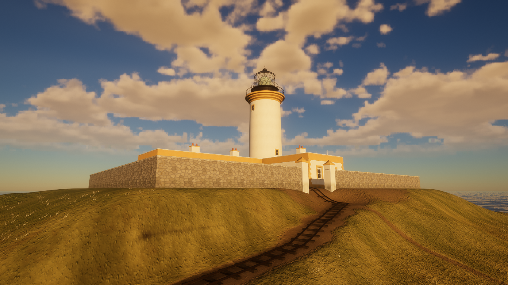
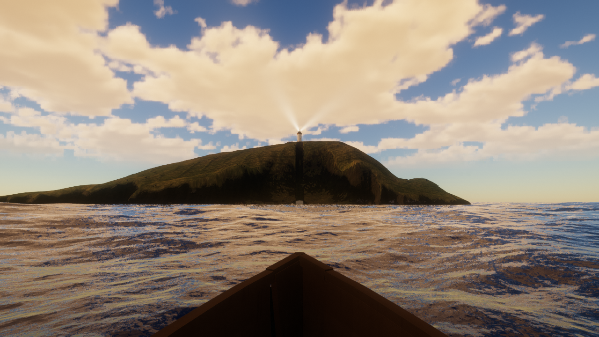
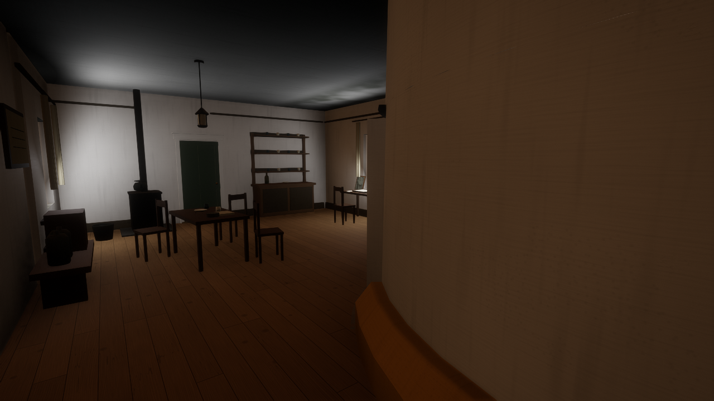
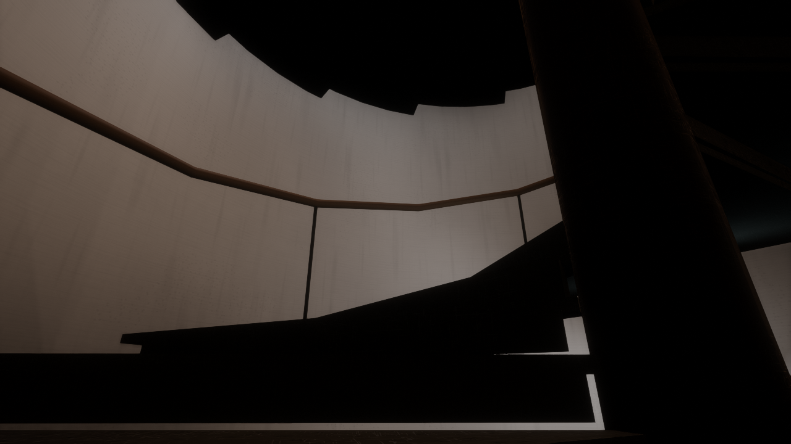
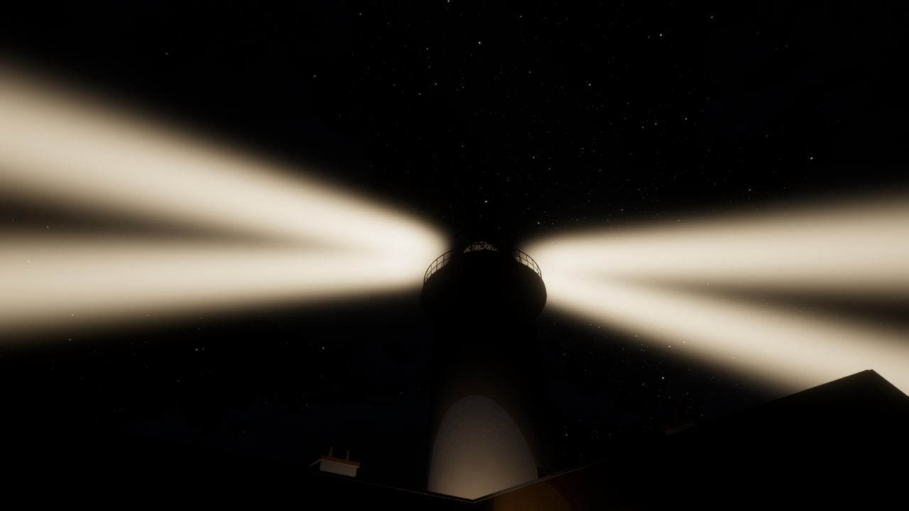

# Seven Hunters

### Three keepers vanished. Tonight, the light is yours.

A first-person narrative exploration game set on a remote Scottish lighthouse island in January 1901. Arrive by boat, learn the keeper's routine, and reach a stranger across the sea by signal lamp as the weather closes in.

The game now continues after the first journal through 6 January: a kitchen and sleeping berth, a daylight hauling-shed round, Cate's report of a light while you slept, and an unsettling walk home. Signals show received Morse beside decoded words, with familiar shortcuts and occasional Gaelic with English. See [the fixed story and playable continuation](docs/STORY-CONTINUATION.md). Open `/next-watch.html` to start day two or review later scenes in separate save slots. The later storm and relief are still planned chapters.

**[▶ Play in your browser](https://thehillbeyondthisone.github.io/seven-hunters/)** · [Report a problem](https://github.com/thehillbeyondthisone/seven-hunters/issues) · [Historical sources](#history-and-fiction)

[](https://github.com/thehillbeyondthisone/seven-hunters/actions/workflows/deploy.yml)



*Eilean Mòr, the Flannan Isles. A winter afternoon is already giving way to night.*

The local [surface comparison](http://127.0.0.1:5189/artifacts/surface-pass/index.html)
shows the new timber, limewash, paint, iron and stone normal/roughness maps in
matched daylight and lantern-lit views. Run `start.bat` to inspect or play them.
See [surface details and validation](docs/SURFACES.md).

The local [weather observation study](http://127.0.0.1:5189/weather-observations.html)
starts either evening round with a separate save. Read graduated instruments,
observe the roof vane, watch the sea and check landmark bearings before chalking
the slate. See [controls, reconstruction boundaries and validation](docs/WEATHER-OBSERVATIONS.md).

| | |
|---|---|
| **What it is** | An atmospheric story about isolation, responsibility, and a voice across the water |
| **Current release** | A playable story from the boat approach through the watches of 6 January |
| **Play time** | Allow roughly 20–30 minutes, depending on how much you explore and read |
| **How to play** | Desktop keyboard and mouse, or phone/tablet touch controls; no download or account required |
| **Mood** | Quiet, eerie, and grounded in the sea and weather |

## Your posting

In December 1900, three lighthouse keepers disappeared from Eilean Mòr, a small rocky island off Scotland's Outer Hebrides. When the relief vessel arrived on 26 December, the station was empty. The men were never found.

The light still has to be kept.

The game begins on **3 January 1901**. You are a newly posted keeper, approaching the island in the *Hesperus*'s landing boat. A letter from home and your instructions sit in your coat. The sea prevents the rest of the crew from landing, leaving you to take the first watch alone.

Across the water, a watcher on the coast of Lewis looks for your light. On clear nights, you can answer her with a signal lamp. When the sea fog comes in, even that small connection can disappear.

**Seven Hunters** is a traditional name for the Flannan Isles themselves. The title belongs to the landscape that surrounds you.

## What you do

- **Make landfall.** Look around during the crossing, read your papers, and climb from the east landing to the station.
- **Keep the light.** Find the lamp, light it at sunset, and wind the clockwork that turns its great lens. Listen for the bell when the machine needs attention.
- **Unpack your things.** Once the light is working, open your bag and discover the Brownie Mary sent. Its one roll holds six pictures to bring home; this scene introduces the camera before photography arrives in a later chapter. [Local scene review](public/unpacking.html).
- **Keep the record.** Observe the weather and chalk your readings on the station slate.
- **Find someone out there.** Use a telescope to read the Watcher's flashes and reply from the signal lamp. Choose a brief station signal or a personal reply; the lamp sends it for you. You do not need to know Morse code.
- **Keep the watch.** Explore the house, tower, landings, and island as daylight fades. Carry a storm lantern when the rooms and paths grow dark.
- **Decide what to write.** After sunrise, finish the night's journal. Your observations—and what you choose to leave out—become the record.

The game takes inspiration from *Firewatch*: a solitary job, a distant companion, and a place that becomes harder to read after dark. Here, your connection depends on visibility, and your work depends on a lamp and a winding handle.

## A look around

| The crossing | The keepers' room |
|---|---|
|  |  |
| Read the papers in your coat while the boat approaches. | Find your instructions and the tools for the watch. |

| The tower stairs | The night watch |
|---|---|
|  |  |
| Climb through the tower to the lamp and its clockwork. | The beam is your presence across the sea. |

*These are captures of the game scene at scripted viewpoints, rendered by the game's own WebGPU renderer. They are not concept paintings. Performance and appearance vary with browser and hardware.*

## Getting started

1. Open **[Play Seven Hunters](https://thehillbeyondthisone.github.io/seven-hunters/)** in a browser with WebGPU enabled. Phones and tablets automatically show touch controls; landscape gives you the clearest view.
2. Let the first load finish. The renderer compiles hundreds of shaders; this can take a minute or more on some machines. Keep the tab open while it prepares the scene.
3. Tap or click to begin, then follow the opening cards. On mobile, **Read papers** opens your packet; **Go to landing** finishes the crossing, then **Step ashore** leaves the boat. On desktop, **B** opens papers and **Enter** advances the approach and steps ashore. Reading pauses the approach.
4. Follow the path up to the station and read the Board's letter in the keepers' room. Small objective markers help you find the next task; arrows point toward it when it is off screen.
5. Look at an object and tap its named action button on mobile, or use **E** on desktop. Hold the action button (or **E**) for tasks that ask you to keep it pressed.

You can disable objective markers in **H → Camera → Keeping the watch**. The night saves automatically in this browser; returning offers to continue or begin again. Reading pages pauses the story clock, and some prompts let you wait until the next event.

### Touch controls

- **Drag on the left** to walk; **drag on the right** to look. Use both thumbs together.
- **Read papers → Go to landing → Step ashore** gets you from the boat to the island. Reading is optional, and you can wait for the boat to arrive naturally.
- **Tools** opens your Lantern, Telescope, Papers, Hurry and Jump. Equipment becomes available when collected.
- **Pause** stops the watch and opens sound and graphics settings. The settings panel includes **Touch controls** help.
- Touch buttons use large period lettering, prevent accidental text selection, and work while another finger is walking or looking.

See [mobile controls and local phone setup](docs/MOBILE.md). For a forced touch view, use [the mobile link](https://thehillbeyondthisone.github.io/seven-hunters/?mobile).

### Keyboard and mouse

| Input | Action |
|---|---|
| **W A S D** | Walk |
| **Shift** | Hurry |
| **Mouse** | Look; click the scene to capture the mouse |
| **Esc** | Release the mouse; dismiss supported reading panels |
| **E** | Use doors, papers, the slate, the journal, and the signal lamp |
| **Hold E** | Light the lamp or wind its clockwork |
| **Enter** | On the boat: advance the approach, then step ashore |
| **B** | Reopen the papers in your coat |
| **Right mouse button** | Look through the telescope after collecting it |
| **L** | Toggle your storm lantern after taking it from the keepers' room |
| **Space** | Read the Watcher's signals faster |
| **H** | Open settings |
| **M** | Mute sound |
| **P** | Photo mode |
| **F1** or **?** | Show all controls |
| **Backtick (`)** | Desktop simulation debug menu: minigun, extreme weather, tsunami and underwater blast |

### Requirements and troubleshooting

The game has **mobile touch controls**: a floating left
thumbstick, right-side drag to look, contextual actions and a Tools drawer.
Double-click `start-mobile.bat` for an HTTPS link to open on a phone on the same
Wi-Fi. See [mobile controls and setup](docs/MOBILE.md). Phone performance and
physical touch/audio still need device testing; browser checks verify the interface and game flow.

- **WebGPU support is required.** Browser version, operating system, GPU, and driver all affect availability. Hardware acceleration should be enabled. WebGPU-enabled Safari may also work; support is not certified across all browser/device combinations.
- **Desktop uses keyboard and mouse.** Phones and tablets select touch controls automatically. Sustained mobile performance is not established.
- **A capable GPU helps.** Dynamic resolution can reduce rendering resolution on slower machines. Use **H** to adjust graphics settings if play is sluggish.
- **If loading fails,** check the displayed error, update the browser and graphics driver, and try Chrome or Edge with hardware acceleration enabled. If reporting a bug, include the browser, GPU, error text, and where it occurred.
- **Saves are local to your browser.** Clearing site storage can erase them; private browsing and another computer may not retain the same progress.

## History and fiction

The disappearance of **James Ducat, Thomas Marshall, and Donald MacArthur** in December 1900 is real. The official investigation concluded that an exceptionally large sea probably swept the men away while they were dealing with equipment near the west landing. Exactly what happened remains unknown.

The game uses the real island and terrain data, the lighthouse station, and period sources as its foundation. It does not claim to be a measured reconstruction of every room, furnishing, or piece of equipment.

**Your keeper, Walter Innes, the Watcher, Ceit “Cate” Macleod, their conversations, the home letter, and the posting are fictional.** The historical use of an observer on Lewis is documented. The game's two-way Morse lamp link, numbered signal groups and relationship are invented. The boat, interiors, and several visual details are provisional reconstructions.

Routine lamp messages are brief, usually five to fifteen words, with shorter acknowledgements and goodbyes. Longer thoughts take more than one exchange. In the game's chosen convention, **K** asks for an answer; it does not end a conversation. The real Flannan station's ball or disc signals are a possible later addition and are not yet implemented.

Famous embellishments such as ominous diary entries, an untouched meal, and an overturned chair are not established facts of the official record. The game treats the documented tragedy and later stories as different things.

Start with these sources:

- [Northern Lighthouse Board: Flannan Islands](https://www.nlb.org.uk/lighthouses/flannan-islands/) — the station and the islands' “Seven Hunters” name.
- [Northern Lighthouse Board: the disappearance and contemporary reports](https://www.nlb.org.uk/history/flannan-isles/) — the surviving accounts and investigation.
- [National Records of Scotland: the lighthouse keepers' disappearance](https://blog.nrscotland.gov.uk/2023/12/12/flannan-isles-lighthouse-keepers-the-disappearance/) — archival context and records.
- [Project plan and source ledger](docs/PLAN.md) — detailed research, reconstruction boundaries, and the intended longer game. **Contains story spoilers and plans beyond the demo.**

## What is included today

The main release continues **through 6 January**, with the boat opening, station exploration, lighthouse duties, weather observations, signal conversations, fog, journals, kitchen and berth, and hauling-shed rounds. Save/resume, objective guidance and desktop photo mode are implemented. The later storm and relief remain planned chapters.

There are also separate exploration and development routes:

| Link | What it opens |
|---|---|
| [Explore the island](https://thehillbeyondthisone.github.io/seven-hunters/?nostory) | Walk around without the story schedule |
| [Sea and weather preview](https://thehillbeyondthisone.github.io/seven-hunters/?weatherPreview) | An experimental cycle from settled conditions to an Atlantic gale |
| [Boat arrival preview](https://thehillbeyondthisone.github.io/seven-hunters/?arrivalPreview) | Try the opening with a separate preview save |
| [Tidewater](https://thehillbeyondthisone.github.io/seven-hunters/?setting=tidewater) | The original island fishing game retained in the codebase |

An experimental WebXR exploration preview is documented in [VR-PREVIEW.md](docs/VR-PREVIEW.md). It has not been certified for physical headset performance, controls, or comfort. The weather and VR previews are separate from the main story demo; they do not imply that the longer game's planned storm sequence is complete.

The desktop build has a [simulation room](docs/SIMULATION-ROOM.md), opened with **backtick** or the **Debug** button. It exposes the minigun (the existing F8 shortcut still works), Force 11/12 storms, a travelling tsunami surge and an underwater blast. Open `/simulation.html` for a separate, save-free lab at the west landing. These events are experiments, separate from the authored story. Waypoints now briefly ping with expanding rings and a label when their destination changes, then settle to the small marker; reduced-motion settings use a static highlight.

The local [Keeper’s Playground](docs/KEEPER-PLAYGROUND.md) adds a bespoke brass
gravity grabber and a lighthouse disco. Run `start-playground.bat` or choose it
from Experiences: click to grab a buoy/crate, charge a throw with right click,
and press **J** for colored beams, a mirror ball and optional synth music. This
desktop toybox opens no watch save and remains separate from the authored story.

## Run it locally

Install **Node.js 22 or newer**, then:

```sh
git clone https://github.com/thehillbeyondthisone/seven-hunters.git
cd seven-hunters
npm ci
npm run dev
```

Open **http://127.0.0.1:5189/**. On Windows, after installing dependencies, `start.bat` starts the local game; it clears any listener on port 5189 first.

```sh
npm run build          # Create the static site in dist/
npm run preview        # Serve that production build locally
npm test               # Logic, route, story, guidance, and native WebGPU engine checks
npm run test:weather   # Weather logic checks
npm run test:xr-scene  # Native WebGPU stereo scene checks
```

The final part of `npm test` requires a working native WebGPU adapter. Story and route checks can also run independently with `node test/demo-story.mjs` and `node test/demo-walk.mjs`. Automated checks do not establish performance, audio quality, or physical headset behavior.

Pushes to `main` build and deploy `dist/` through [GitHub Actions](.github/workflows/deploy.yml). The site uses relative asset paths so it can run under the `/seven-hunters/` Pages URL.

## Built on Tidewater

Seven Hunters grew out of **[Tidewater by Daniel Greenheck / DRG Software Solutions](https://github.com/dgreenheck/tidewater)**, a browser fishing game with a custom WebGPU engine. Its ocean, atmosphere, rendering foundation, and original fishing mode remain part of this project. [Play the upstream game](https://dgreenheck.github.io/tidewater/).

The renderer uses JavaScript and WGSL, with an FFT ocean, volumetric clouds, atmospheric haze, dynamic lighting, and temporal post-processing. Vite builds the static browser release. Story code lives in `src/story/`, lighthouse machinery in `src/station/`, and the Flannan environment in `src/world/flannan/`.

### AI assistance and provenance

Development uses AI assistance for implementation, writing, research, and visual iteration. This repository's publication and README were prepared with OpenAI Codex. Generated code and historical claims still need review against tests, rendered results, and cited sources; AI output is not archival evidence.

The screenshots above come from the running scene renderer. Third-party models, sounds, terrain data, textures, and their licenses are listed in [CREDITS.md](CREDITS.md). The historical interpretation, hardware compatibility, and longer narrative remain works in progress.

## License and credits

Code is released under the **[MIT license](LICENSE)**, retaining the upstream copyright notice. Third-party assets keep their own licenses. See [CREDITS.md](CREDITS.md) and the credits beside the assets for attribution and terms.
